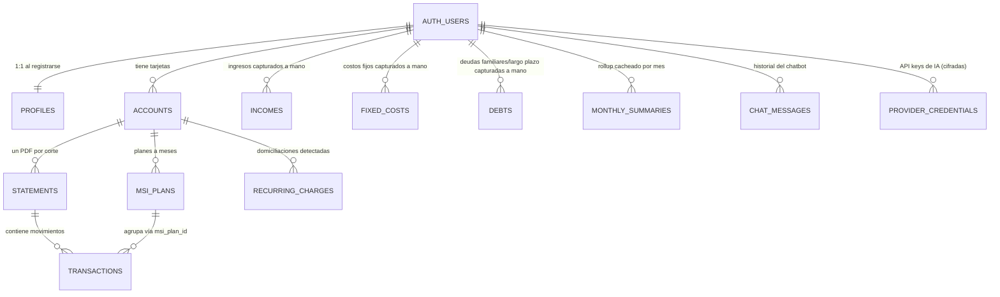

# Diseño de Base de Datos — Finanzas

Postgres (Supabase), multi-usuario desde el día 1. Todas las tablas que
guardan datos de un usuario tienen columna `user_id` y una política RLS
única del patrón:

```sql
using (auth.uid() = user_id)
with check (auth.uid() = user_id)
```

Es decir: cada quien solo puede leer/escribir sus propias filas — la base de
datos lo garantiza, no el código de la app.

## Idea general

Hay tres tipos de datos distintos conviviendo:

1. **Lo que sale de tus PDFs** (automático, vía el Skill de parseo):
   `accounts` → `statements` → `transactions` / `msi_plans`.
2. **Lo que los PDFs no traen y capturas tú a mano**: `incomes` (tus
   ingresos) y `fixed_costs` (renta, servicios, etc.) — es el reemplazo de
   la vieja hoja "cuenta_personal".
3. **Configuración y producto**: `provider_credentials` (tus API keys de
   IA, cifradas) y `chat_messages` (historial del chatbot).

## Diagrama



## Tablas

### `profiles`
1:1 con `auth.users`. Se crea sola vía trigger (`handle_new_user`) la
primera vez que alguien inicia sesión con Google — no hay que insertarla a
mano en ningún lado del código de la app.

| Columna | Tipo | Nota |
|---|---|---|
| `id` | uuid (PK) | = `auth.users.id` |
| `full_name` | text | viene del perfil de Google |
| `created_at` | timestamptz | |

### `accounts` — tus tarjetas
Una fila por tarjeta física/producto (ej. "Banamex Explora", "Amex
Platinum"). El usuario las crea al subir el primer PDF de esa tarjeta (o a
mano, desde la pantalla de subida).

| Columna | Tipo | Nota |
|---|---|---|
| `id` | uuid (PK) | |
| `user_id` | uuid (FK) | dueño |
| `issuer` | text | "Banamex", "American Express"... |
| `product_name` | text | "Explora", "Platinum"... |
| `last4` | text | opcional |
| `credit_limit` | numeric | opcional, se puede llenar después con lo que diga el PDF |
| `rate_ordinaria` / `rate_moratoria` | numeric | tasas anuales |
| `active` | boolean | |

El usuario puede editar (`PATCH`), borrar (`DELETE`) o agregar tarjetas
(`POST`) desde Configuración (`src/components/account-settings.tsx` →
`/api/accounts`). Borrar una tarjeta borra en cascada sus `statements` /
`transactions` / `msi_plans` (`on delete cascade`); `recurring_charges.account_id`
se pone en `null` en vez de borrarse (`on delete set null`). `issuer` y
`last4` también son la referencia contra la que se valida cada PDF nuevo
antes de guardarse — ver "Regla de aislamiento por mes" más abajo.

### `statements` — cada PDF subido
Una fila por PDF procesado. Es el "expediente" de ese corte: fechas,
montos resumen, y el JSON completo que devolvió el Skill (`raw_extraction`,
para auditoría/debug sin tener que re-parsear).

| Columna | Tipo | Nota |
|---|---|---|
| `id` | uuid (PK) | |
| `user_id`, `account_id` | uuid (FK) | |
| `file_path` | text | ruta en Supabase Storage (bucket `statements`) |
| `period_start`, `period_end`, `cut_date`, `due_date` | date | |
| `previous_balance`, `new_charges`, `payment_no_interest`, `payment_minimum` | numeric | |
| `interest_charged`, `iva_interest` | numeric | default 0 |
| `status` | text | `pending` → `parsed` \| `error` |
| `raw_extraction` | jsonb | el JSON completo del Skill (incluye `warnings`) |
| `uploaded_at`, `parsed_at` | timestamptz | |

### `transactions` — cada movimiento
El detalle línea por línea de un `statement`. Es lo que el dashboard y el
chatbot consultan para casi todo.

| Columna | Tipo | Nota |
|---|---|---|
| `id` | uuid (PK) | |
| `user_id`, `statement_id`, `account_id` | uuid (FK) | |
| `tx_date` | date | |
| `description` | text | Ya limpia (capitalización legible, sin prefijos de procesador de pagos ni folios) — ver `description_cleaned` |
| `amount` | numeric | positivo = cargo, negativo = pago/abono |
| `type` | text | `regular` \| `msi` \| `interest` \| `fee` \| `payment` |
| `msi_plan_id` | uuid (FK, opcional) | si `type = 'msi'`, a qué plan pertenece |
| `category` | text | `comida` \| `ropa` \| `transporte` \| `hogar` \| `entretenimiento` \| `tech` \| `viaje` \| `salud` \| `intereses_comisiones` \| `otros` (ver `src/lib/transaction-categories.ts`). La asigna el Skill al parsear cada PDF nuevo; para transacciones guardadas antes de esto existe un backfill manual (`/api/transactions/categorize`, botón "Categorizar movimientos" en Desglose) que la asigna sin re-leer el PDF |
| `description_cleaned` | boolean | `true` si `description` ya pasó por limpieza (el Skill la deja lista desde el parseo). Para transacciones guardadas antes de esto (`false` por default), backfill manual (`/api/transactions/clean-descriptions`, botón "Limpiar descripciones" en Movimientos Relevantes) que reescribe la descripción sin re-leer el PDF |

### `msi_plans` — meses sin intereses activos
Una fila por plan (no por mensualidad individual). Se actualiza cada vez
que se procesa un nuevo statement de esa tarjeta: si el concepto ya existía
como plan activo, se actualiza `installments_paid`; si no, se crea.

| Columna | Tipo | Nota |
|---|---|---|
| `id` | uuid (PK) | |
| `user_id`, `account_id` | uuid (FK) | |
| `concept` | text | ej. "Apple Store (Andy)" |
| `original_amount`, `monthly_payment` | numeric | |
| `total_installments`, `installments_paid` | int | |
| `first_statement_id` | uuid (FK) | en qué statement se vio por primera vez |
| `status` | text | `active` \| `finished` |

### `recurring_charges` — domiciliaciones
Detección automática (`src/lib/recurring-charges.ts`, sin IA — es
determinístico) que corre al terminar de parsear un statement: si la
descripción normalizada de un cargo (`type` `regular` o `fee`) aparece en 2
de los últimos 3 statements parseados de esa cuenta, se marca como
domiciliación activa (`typical_amount` = promedio, `first_seen`/`last_seen`
de las fechas encontradas). Si una domiciliación activa no aparece en el
statement recién parseado, se marca `active = false` (se asume cancelada o
pagada por otro medio). Coincidencia por texto exacto normalizado — no hay
fuzzy matching, así que un cambio de descripción entre meses no se detecta.
La suma de `typical_amount` de las domiciliaciones activas
(`domiciliacionesTotal` en `get-monthly-data.ts`) se resta también en "Cuánto
puedes gastar el próximo mes" — son cargos a la tarjeta tan comprometidos
como una mensualidad MSI, aunque no pasen por `msi_plans`.

### `incomes` — tus ingresos (captura manual)
Los PDFs de tarjeta nunca traen tu nómina ni transferencias que recibes —
por eso esta tabla existe aparte y se llena desde la pantalla de
Desglose del dashboard.

| Columna | Tipo | Nota |
|---|---|---|
| `id` | uuid (PK) | |
| `user_id` | uuid (FK) | |
| `concept` | text | "Nómina", "Estela", etc. |
| `amount` | numeric | |
| `month` | date | primer día del mes al que aplica (o del mes en que empieza, si `is_recurring`) |
| `is_recurring` | boolean | `false` = temporal, solo cuenta para `month`. `true` = "fijo": cuenta para `month` y todos los meses siguientes, indefinidamente, hasta que se borre la fila. `get-monthly-data.ts` arma esto con un filtro `month = mes actual OR (is_recurring AND month <= mes actual)` — nunca cuenta hacia atrás de su mes de creación. Además de filtrar qué cuenta para el mes en curso, distingue qué proyectar al mes siguiente: la pestaña "Próximo Mes" (`ingresoRecurrente`/`egresoDebitoRecurrente`) solo suma las filas con `is_recurring = true` de este mes, porque un ingreso/costo "Temporal" por definición no vuelve a aparecer — incluirlo en la proyección inflaría o desinflaría el número artificialmente |

### `fixed_costs` — costos fijos (captura manual)
Igual que `incomes` pero para gasto fijo recurrente que no pasa por
tarjeta (renta, servicios, etc.). Mismo shape que `incomes`, incluyendo
`is_recurring` con el mismo significado (temporal = solo su mes; fijo =
desde su mes en adelante).

### `debts` — deudas familiares/largo plazo (captura manual)
Préstamos de cripto, dinero prestado a/por familiares, etc. — **no** tiene
columna `month` a propósito: a diferencia de `fixed_costs`, no es un gasto
recurrente de este mes, es un saldo pendiente que normalmente no se paga
este mes. Por eso **no** se resta del balance mensual — solo se muestra
como referencia en el panel "Panorama de Deudas" del dashboard, junto con
la deuda de MSI restante de las tarjetas (`msi_plans`, calculada como
`monthly_payment × (total_installments − installments_paid)` por cuenta).

| Columna | Tipo | Nota |
|---|---|---|
| `id` | uuid (PK) | |
| `user_id` | uuid (FK) | |
| `concept` | text | "Cripto (Prestado)", "Estela (Familiar)", etc. |
| `amount` | numeric | |
| `note` | text | opcional, ej. "No se paga este mes" |

### `monthly_summaries` — insights + recomendaciones del mes
Se usan dos columnas jsonb, generadas juntas en la misma llamada al modelo
(`regenerateMonthlySummary` en `src/lib/ai/monthly-insights.ts`) para no
duplicar costo de API:

- `insights`: array de exactamente 3 `{ text, tone }` ("3 cosas que pasaron
  este mes que vale la pena que veas") — usa el `raw_extraction` de los
  statements del mes actual + el anterior.
- `recommendations`: array de 2 a 4 `{ text, type }` con `type` = `strength`
  (algo que el usuario ha hecho bien de forma consistente) o `action` (algo
  que debería cambiar) — "🎯 Recomendaciones y Próximos Pasos". Además del
  mes actual/anterior, el prompt recibe hasta 6 meses de historial
  *resumido* (los `insights` ya guardados de esos meses, no el JSON crudo
  completo — barato y ya "curado") para detectar patrones repetidos.

Se dispara solo al terminar de parsear un statement, o a mano desde el
botón "Regenerar análisis" del dashboard (`/api/insights/generate`). Las
columnas `income_total`/`expense_total`/`balance` siguen sin usarse —
`get-monthly-data.ts` las sigue calculando al vuelo; cachearlas ahí es una
optimización futura, no bloquea nada de esto.

### `chat_messages` — historial del chatbot
Conversación completa, por usuario, en orden cronológico. El endpoint de
chat lee las últimas ~20 como contexto de cada nueva pregunta.

### `provider_credentials` — tus API keys de IA
| Columna | Tipo | Nota |
|---|---|---|
| `provider` | text | `anthropic` \| `openai` \| `gemini` \| `deepseek` |
| `api_key_encrypted` | text | cifrada con AES-256-GCM antes de llegar aquí, nunca en texto plano |
| `is_active` | boolean | cuál se usa ahora mismo para parsear/chatear |
| `orchestrator_enabled` | boolean | para cuando se construya el modo orquestador (combinar proveedores) |

## Flujo de datos (de PDF a dashboard)

```
Subes un PDF (eligiendo a mano a qué tarjeta pertenece)
  → se guarda en Storage (bucket "statements", ruta {user_id}/{account_id}/...)
  → se crea una fila en `statements` (status: pending)
  → el Skill lee el PDF y regresa JSON (cuenta + statement + movimientos + planes MSI)
  → se valida que el emisor/últimos 4 dígitos extraídos del PDF correspondan
    a la tarjeta seleccionada (`src/lib/statement-account-match.ts`) — si no
    coinciden, el statement se marca `error` y no se guarda nada más (evita
    mezclar el PDF de una tarjeta con la cuenta de otra; ver incidente real
    documentado abajo)
  → se actualiza la fila de `statements` (status: parsed, + raw_extraction)
  → se hace upsert de `msi_plans` (por account_id + concepto)
  → se insertan las filas en `transactions`
  → el Dashboard agrega todo esto + incomes + fixed_costs → KPIs del mes
  → el Chatbot consulta estas mismas tablas en vivo cuando le preguntas algo
```

## Notas de seguridad

- RLS activo en **todas** las tablas de usuario — sin excepción.
- El bucket de Storage tiene sus propias policies (no solo RLS de tabla):
  cada quien solo puede leer/subir/borrar archivos bajo su propia carpeta
  `{user_id}/...`.
- Las API keys de IA nunca se guardan en texto plano ni se regresan
  completas al frontend (se enmascaran: `sk-a••••••••3456`).
