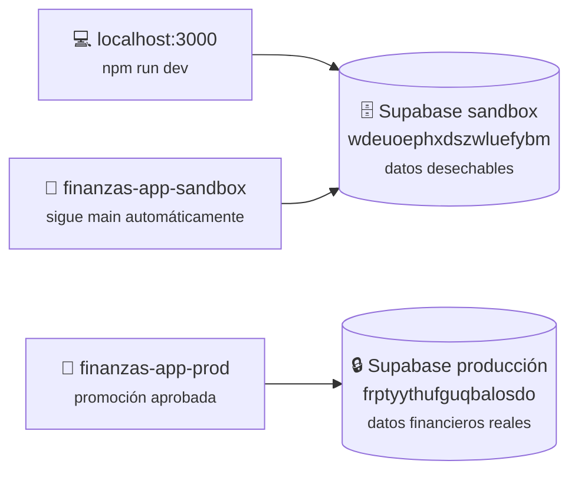
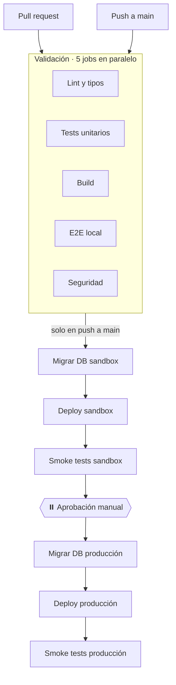

# Ambientes y CI/CD

Bitácora de qué existe, dónde vive y cómo se publica. Se actualiza cuando algo
cambia.

> **Nunca escribas valores de secretos en este archivo.** Solo nombres,
> ubicaciones y referencias públicas (project refs, project IDs y URLs sí van;
> keys, passwords y tokens no). Este repo es público.

## Los tres lugares donde corre la app



**Localhost y sandbox comparten base a propósito.** Así lo que subes en tu
máquina lo ves también en el sandbox desplegado, y tus pruebas nunca tocan
datos reales. El mismo código lee las mismas variables en los tres lugares:
lo único que cambia es el valor de `NEXT_PUBLIC_SUPABASE_URL`, así que **no
hay que cambiar configuración para moverse entre ambientes**.

| | **sandbox** | **producción** |
|---|---|---|
| Para qué | Probar todo: PDFs de prueba, migraciones nuevas, cambios de UI | Datos financieros reales |
| Se actualiza | Automático en cada push a `main` | Promoción manual aprobada |
| Proyecto Supabase | `Finanzas-Sandbox` · ref `wdeuoephxdszwluefybm` | ref `frptyythufguqbalosdo` |
| URL Supabase | `https://wdeuoephxdszwluefybm.supabase.co` | `https://frptyythufguqbalosdo.supabase.co` |
| Proyecto Vercel | `finanzas-app-sandbox` · `prj_HWDPp6GQU8LUlefqZQ6rTCEmBJ1n` | `finanzas-app-prod` · `prj_NPunntjv2LYfU5c2eyiEsN5qUjHp` |
| URL pública | `https://finanzas-app-sandbox-gergodfreys-projects.vercel.app` | `https://finanzas-app-prod-gergodfreys-projects.vercel.app` |
| GitHub Environment | `sandbox` (sin protección) | `production` (required reviewer) |
| Quién aprueba | — | `GerGodfrey` |

Equipo de Vercel: `gergodfreys-projects` · `orgId` `team_6fPVxrIPp8k6AyzTD79xfvMd`
(el mismo para los dos proyectos).

> **Ojo con las URLs**: Vercel asigna `<proyecto>-<equipo>.vercel.app`. La forma
> corta (`finanzas-app-sandbox.vercel.app`) **no está asignada** y devuelve 404.
> Usa siempre la larga.

## Desarrollo local

`.env.local` apunta al **sandbox**, no a producción. Para recrearlo desde cero
sin copiar secretos a mano (el proyecto local está enlazado al sandbox):

```bash
npx vercel env pull .env.local --environment=production
```

Trae las tres variables del proyecto de Vercel del sandbox, incluida su
`ENCRYPTION_KEY` — necesaria para que lo que cifres en local sea legible por el
sandbox desplegado, y al revés.

Para apuntar localhost a **producción** temporalmente (solo para depurar algo
que únicamente ocurra ahí): guarda tu `.env.local` actual, sustituye las tres
variables por las del proyecto de producción, y reinicia el dev server. No lo
dejes así.

Para que el login con Google funcione en local, `http://localhost:3000/**` debe
estar en las **Redirect URLs** del Supabase del sandbox (ver más abajo).

---

## Cómo funciona el CI/CD



Todo vive en un solo archivo: [`.github/workflows/ci.yml`](../.github/workflows/ci.yml).

### Validación

Corre en cada pull request **y** en cada push a `main`. Los cinco jobs van en
paralelo, así que el feedback llega en menos de un minuto:

| Job | Qué hace | Bloquea |
|---|---|---|
| Lint y tipos | `eslint` + `tsc --noEmit` | sí |
| Tests unitarios | los 77 de Vitest, sin credenciales reales | sí |
| Build | `next build` con variables dummy, hermético | sí |
| E2E local | Playwright contra un `next dev` propio | sí |
| Seguridad | `gitleaks` + `npm audit` | solo secretos filtrados y vulnerabilidades críticas |

Un hook de **pre-push** (Husky) corre lint, tipos y unitarios en tu máquina
antes de dejar salir el push: el mismo error, 10 segundos antes en vez de 3
minutos después.

### Publicación

La cadena de deploy solo arranca en push a `main` y solo si los cinco jobs
anteriores pasaron. Si alguno falla, `needs:` salta toda la cadena sola.

Producción es **una promoción del mismo commit** ya verificado en sandbox,
nunca un build distinto. El pipeline se detiene en el gate y no avanza hasta
que un revisor aprueba desde la pestaña Actions.

### Decisiones que conviene no revertir sin pensarlo

**Migrar va antes de deployar.** El código nuevo suele depender de columnas
nuevas; al revés, la app viva pega contra un esquema viejo. Si la migración
falla, el deploy simplemente no corre y nada cambió de cara al usuario.

**Vercel no deploya por su cuenta.** La integración de Git está desconectada y
`vercel.json` la bloquea con `git.deploymentEnabled: false`. Si Vercel deployara
al detectar un push, se saltaría el gate de aprobación por completo.

**`vercel.json` declara `"framework": "nextjs"`.** Los proyectos se crearon con
`vercel project add`, sin importar desde Git, así que Vercel nunca detectó el
framework. Sin esa línea, `vercel build` corre `next build` pero no sabe
convertir `.next` en funciones serverless: publica un sitio estático vacío que
devuelve 404 en todas las rutas.

**El respaldo previo a migrar prod sube solo el esquema.** Este repo es público
y los artifacts de Actions se descargan sin autenticación: un dump de datos
publicaría los movimientos bancarios. El respaldo de datos se hace a mano antes
de aprobar (ver [`deploy.md`](./deploy.md)).

**Los smoke tests reusan los specs de `e2e/`.** Con `PLAYWRIGHT_BASE_URL`,
`playwright.config.ts` no levanta servidor local y pega al deploy real — cero
tests nuevos que mantener.

### Limitación conocida

Los tres jobs de producción referencian el environment `production`, y **GitHub
pide aprobación por cada uno**: son tres clics, no uno. Se arregla fusionándolos
en un solo job (anotado en [`pendientes.md`](./pendientes.md)).

---

## Dónde vive cada variable

Tres lugares distintos, a propósito:

**1. Dashboard de Vercel** — variables de runtime de la app, scope Production de
*cada* proyecto. GitHub nunca las conoce; el CI las obtiene con `vercel pull`.
Una sola fuente de verdad y menor radio de daño si el repo público se
compromete.

| Variable | sandbox | producción |
|---|---|---|
| `NEXT_PUBLIC_SUPABASE_URL` | URL del proyecto sandbox | URL del proyecto prod |
| `NEXT_PUBLIC_SUPABASE_ANON_KEY` | anon key sandbox | anon key prod |
| `ENCRYPTION_KEY` | clave propia del sandbox | clave propia de prod (distinta) |

**2. Secrets y variables de repo en GitHub** — credenciales de cuenta que
sirven para ambos ambientes.

| Nombre | Tipo |
|---|---|
| `SUPABASE_ACCESS_TOKEN` | secret |
| `VERCEL_TOKEN` | secret |
| `VERCEL_ORG_ID` | variable |

**3. Secrets y variables por GitHub Environment** — lo específico de cada
ambiente. Los nombres difieren por ambiente para que un job no pueda tomar por
error los del otro.

| Environment `sandbox` | Environment `production` | Tipo |
|---|---|---|
| `SANDBOX_SUPABASE_PROJECT_REF` | `PROD_SUPABASE_PROJECT_REF` | secret |
| `SANDBOX_SUPABASE_DB_PASSWORD` | `PROD_SUPABASE_DB_PASSWORD` | secret |
| `VERCEL_PROJECT_ID_SANDBOX` | `VERCEL_PROJECT_ID_PROD` | variable |
| `SANDBOX_URL` | `PROD_URL` | variable |

**Límite honesto:** `SUPABASE_ACCESS_TOKEN` y `VERCEL_TOKEN` son de cuenta
completa — pueden tocar cualquier proyecto sin importar en qué environment estén
guardados. Los GitHub Environments controlan *cuándo* corre un job (aprobación)
y *qué secretos ve*, no son una frontera técnica dura entre sandbox y prod.
Aislarlos de verdad requeriría cuentas separadas, que no vale la pena para un
proyecto de una persona.

## Reglas de rotación

| Secreto | ¿Se puede rotar? | Notas |
|---|---|---|
| `ENCRYPTION_KEY` | **NUNCA** | Cifra las API keys de IA de cada usuario (`provider_credentials.api_key_encrypted`). Si cambia, todas quedan indescifrables y cada usuario tiene que volver a capturar la suya. Write-once por ambiente. |
| `VERCEL_TOKEN` | Sí, cuando quieras | Solo actualiza el secret en GitHub |
| `SUPABASE_ACCESS_TOKEN` | Sí, cuando quieras | Solo actualiza el secret en GitHub |
| `SUPABASE_DB_PASSWORD` | Sí, con cuidado | Cámbiala en el dashboard de Supabase y actualiza el secret del environment correspondiente, o el pipeline de migraciones falla |
| anon key de Supabase | Solo si se compromete el proyecto | Es pública por diseño (va al cliente); su seguridad depende de RLS, no de mantenerla secreta |

## Setup manual por ambiente

Lo que el pipeline **no** puede automatizar. Ambos ambientes quedaron
completados el 2026-09-06:

**sandbox**
- [x] Proyecto de Supabase creado, `project ref` y DB password anotados
- [x] `supabase db push` aplicó las migraciones (crea tablas, RLS y el bucket)
- [x] Proveedor Google habilitado en Supabase Auth (client ID y secret de Google Cloud Console)
- [x] En Google Cloud Console: `https://<ref>.supabase.co/auth/v1/callback` agregado a "Authorized redirect URIs"
- [x] En Supabase Auth → URL Configuration: **Site URL** y **Redirect URLs** con la URL de Vercel, más `http://localhost:3000/**` para desarrollo local
- [x] Proyecto de Vercel creado **sin conectar Git**
- [x] Las 3 variables cargadas en Vercel (scope Production)
- [x] Node.js Version fijado en Vercel en 24.x (igual que `.nvmrc`)
- [x] Vercel Authentication desactivado en Deployment Protection
- [x] GitHub Environment `sandbox` con sus secrets y variables

**producción** — lo mismo, más:
- [x] Required reviewer configurado en el GitHub Environment `production`
- [x] Registro de migraciones reconciliado (ver nota abajo)

> **Nota histórica:** producción se creó antes que este pipeline y sus
> migraciones se aplicaron a mano desde el dashboard, que las registró con
> versiones de timestamp. El CLI no reconocía las nuestras (`0001`–`0010`) y
> `db push` se negaba a avanzar. Se resolvió marcando las nuestras como
> aplicadas y las huérfanas como revertidas, tras verificar con huellas MD5 que
> el esquema de ambos proyectos era idéntico.

## Agregar un tercer ambiente

Si algún día hace falta (por ejemplo `staging`): crear proyecto de Supabase y de
Vercel nuevos, un GitHub Environment con el mismo juego de secrets bajo su
propio prefijo, y agregar los tres jobs (`migrate-` / `deploy-` / `smoke-`)
copiando los del sandbox y cambiando el `environment:`. La app no requiere
ningún cambio: lee las mismas variables, sean del ambiente que sean.
